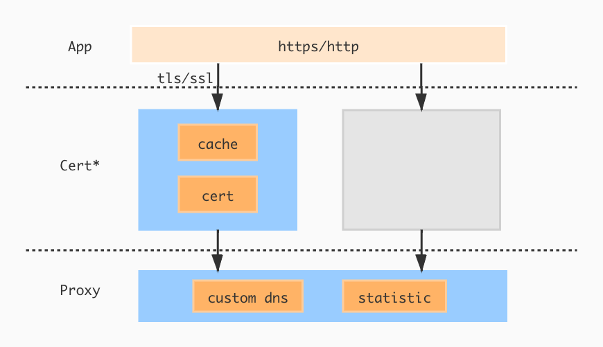

# GoIyov

#### 介绍
golang 代理


#### 安装教程
```bash
 go get -u github/nicecp/GoIyov
```

#### 支持特性
* HTTP/HTTPS代理
* TLS/SSL解密
* MITM(中间人攻击)
* 自定义DNS
* Certificate缓存
* Statistic统计(开发中)



#### 证书安装
```
$ go run main.go [-cert]
    -cert 安装服务端证书，支持MacOS(需root权限)/Windows系统
```

#### 使用说明
```go
// 生成代理类
func (proxy *Proxy) New() *Proxy
```
```go
type Delegate interface {
	BeforeRequest(entity *entity.Entity)
	BeforeResponse(entity *entity.Entity, err error)
	ErrorLog(err error)
}
// 生成代理类, MITM事件处理
func (proxy *Proxy) NewWithDelegate(delegate Delegate) *Proxy
```
```go
// 将host解析至remote地址
func (proxy *Proxy) AddDnsRecord(host,remote string)
```

##### 代理
```go
package main
import (
	"github.com/nicecp/GoIyov"
	"net/http"
	"time"
)

func main() {
	proxy := GoIyov.New()
	// 添加自定义DNS
	proxy.AddDnsRecord("localhost-x","127.0.0.1")
	server := &http.Server{
		Addr:         ":8888",
		Handler:	  http.HandlerFunc(func(rw http.ResponseWriter, req *http.Request) {
			proxy.ServerHandler(rw, req)
		}),
		ReadTimeout:  30 * time.Second,
		WriteTimeout: 30 * time.Second,
	}
	err := server.ListenAndServe()
	if err != nil {
		panic(err)
	}
}
```
##### MITM(中间人攻击)
```go
package main

import (
	"fmt"
	"github.com/nicecp/GoIyov"
	"github.com/nicecp/GoIyov/entity"
	"net/http"
	"time"
)

type Handler struct {
	GoIyov.Delegate
}

func (handler *Handler) BeforeRequest(entity *entity.Entity) {
	fmt.Printf("%+v",entity.GetRequestBody())
}
func (handler *Handler) BeforeResponse(entity *entity.Entity, err error) {
	fmt.Printf("%+v",entity.GetResponseBody())
}
func (handler *Handler) ErrorLog(err error) {}

func main() {
	proxy := GoIyov.NewWithDelegate(&Handler{})
	server := &http.Server{
		Addr: ":8888",
		Handler: http.HandlerFunc(func(rw http.ResponseWriter, req *http.Request) {
			proxy.ServerHandler(rw, req)
		}),
		ReadTimeout:  30 * time.Second,
		WriteTimeout: 30 * time.Second,
	}
	err := server.ListenAndServe()
	if err != nil {
		panic(err)
	}
}
```
##### 移动端如何调试
```
请确保手机及电脑连接同一个局域网，并将移动设备HTTP代理设置为本机`IP:PORT`
1. 浏览器打开 `goiyov.io/ssl`
2. 安装并信任证书
openssl genrsa -aes256 -passout pass:111111 -out openssl.key 1024
openssl req -new -x509 -key openssl.key -passout pass:111111 -out openssl.cer -days 3650 -subj /CN=start.com
openssl x509 -req -days 365 -in openssl.cer -signkey openssl.key -out openssl.crt

openssl genrsa -out client.key 2048
openssl req -new -x509 -key client.key -out client.cer -subj /CN=start.com
openssl req -new -key client.key -out client.csr
openssl x509 -req -in client.csr -CA client.cer -CAkey client.key -out client.crt
openssl req -in client.cer -text

//整体
openssl genrsa -out ca_private.pem 2048
openssl req -new -x509 -days 365 -key ca_private.pem -out ca.crt -subj /CN=start.com
//服务端
openssl genrsa -out server_private.pem 2048
openssl req -new -key server_private.pem -out server.csr -subj "/C=CN/ST=GD/L=SZ/O=COM/OU=NSP/CN=SERVER/emailAddress=youremail@qq.com"
//服务端证书
openssl x509 -req -days 365 -in server.csr -CA ca.crt -CAkey ca_private.pem -CAcreateserial -out server.crt
注入到手机的是ca.crt
```
> 建议使用`MITM`特性，以便查看明文内容
